# H2Oasis Documentation Screenshots

- [H2Oasis Documentation Screenshots](#h2oasis-documentation-screenshots)
  - [Desktop View](#desktop-view)
    - [Systems view in dark mode](#systems-view-in-dark-mode)
    - [Systems view in light mode](#systems-view-in-light-mode)
    - [New system creation in dark mode](#new-system-creation-in-dark-mode)
    - [Single system view in dark mode](#single-system-view-in-dark-mode)
    - [Single system edit in dark mode](#single-system-edit-in-dark-mode)
    - [Single system turned on in dark mode](#single-system-turned-on-in-dark-mode)
  - [Mobile View](#mobile-view)
    - [Systems view in dark mode](#systems-view-in-dark-mode-1)
    - [Systems view in light mode](#systems-view-in-light-mode-1)
    - [New system creation in dark mode](#new-system-creation-in-dark-mode-1)
    - [Single system view in dark mode](#single-system-view-in-dark-mode-1)
    - [Single system edit in dark mode](#single-system-edit-in-dark-mode-1)
    - [Single system turned on in dark mode](#single-system-turned-on-in-dark-mode-1)

## Desktop View
### Systems view in dark mode
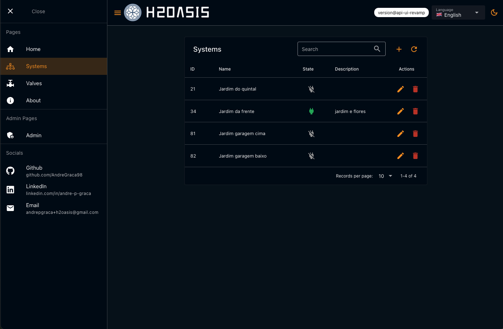

### Systems view in light mode
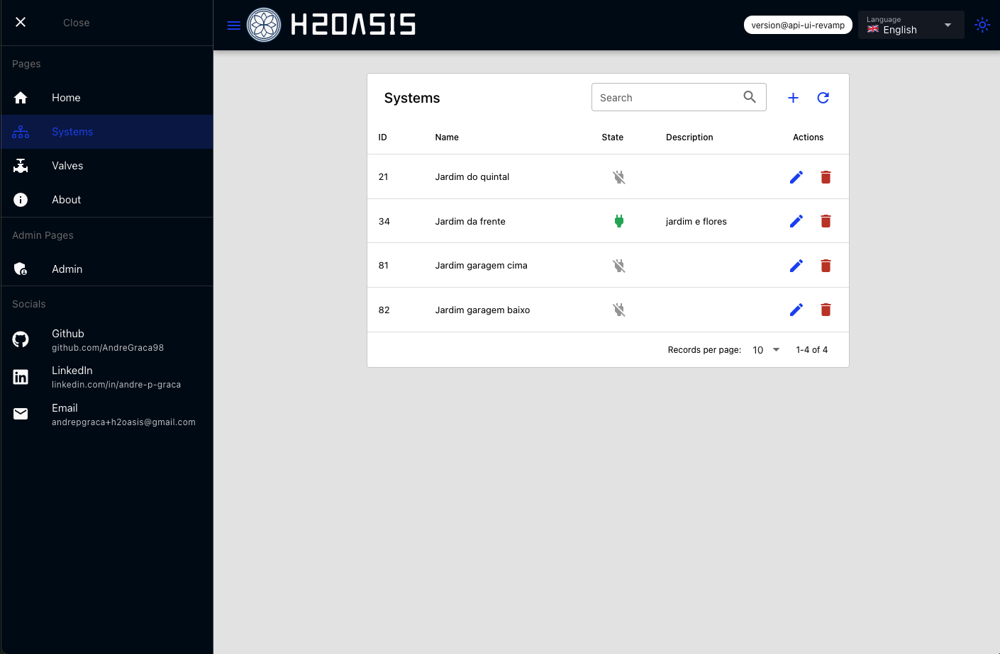

### New system creation in dark mode
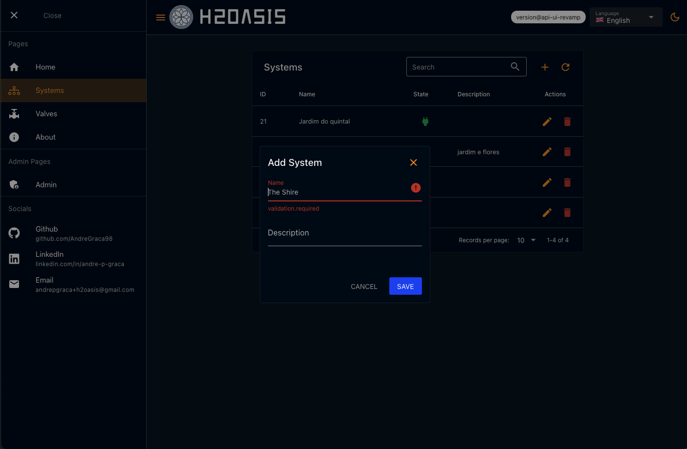

### Single system view in dark mode
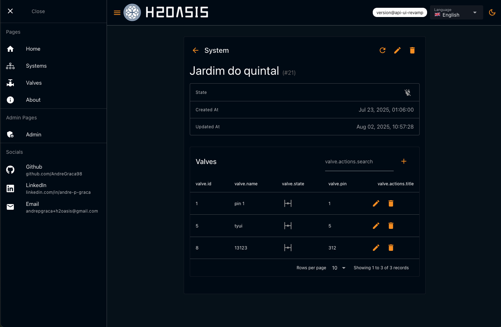

### Single system edit in dark mode
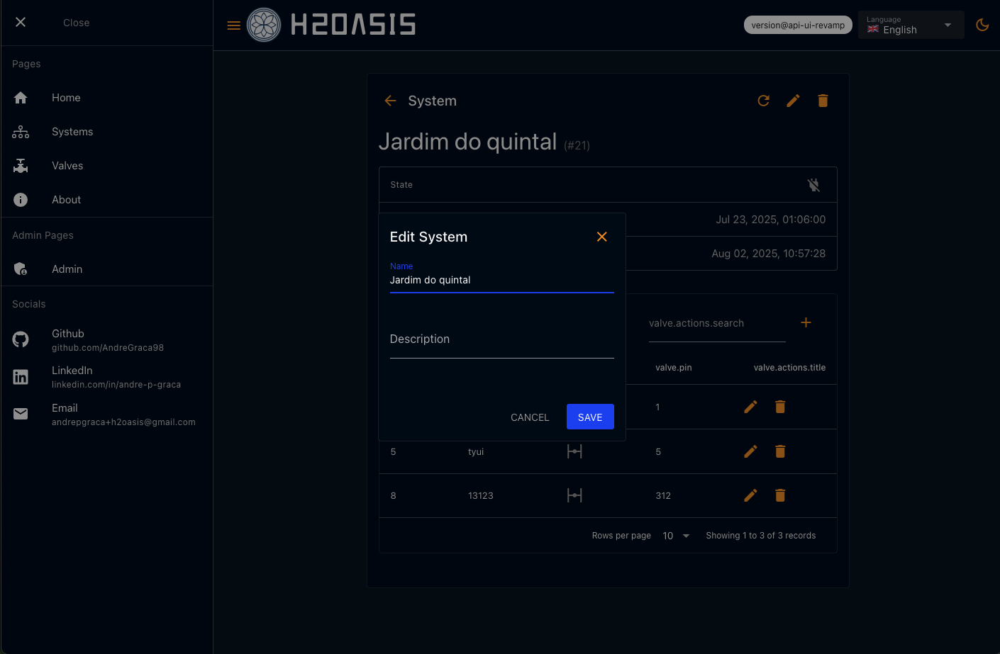

### Single system turned on in dark mode
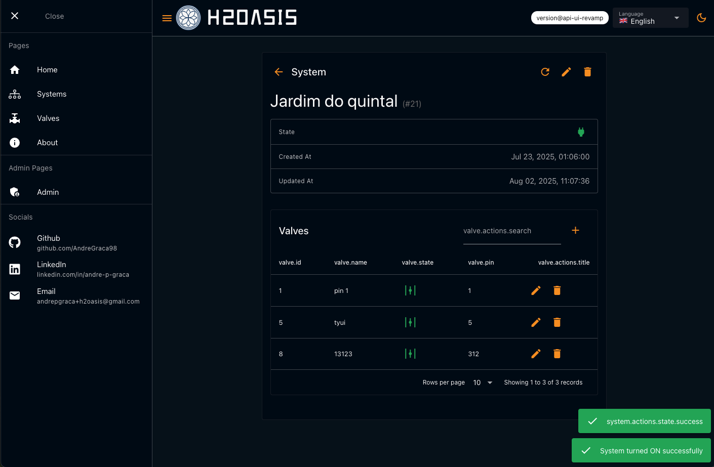

## Mobile View
### Systems view in dark mode
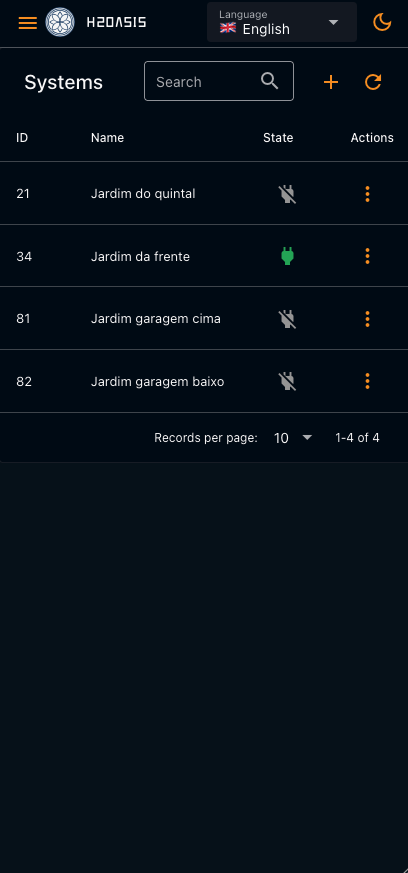

### Systems view in light mode

### New system creation in dark mode
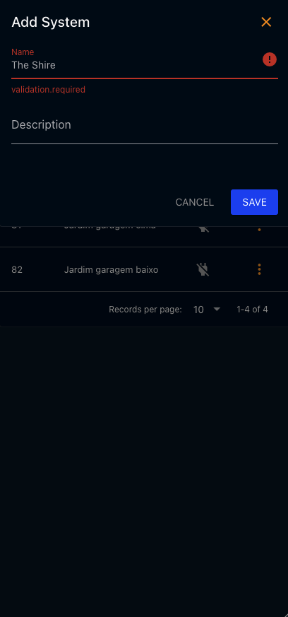

### Single system view in dark mode
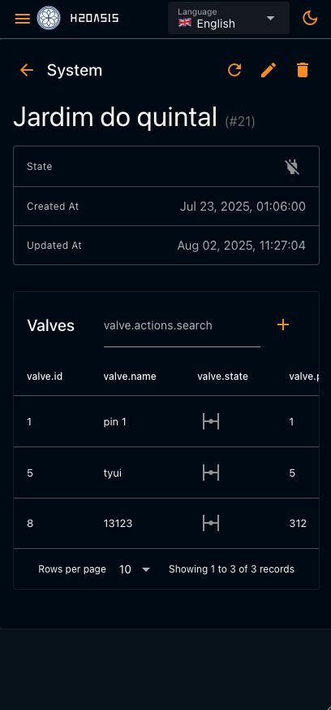

### Single system edit in dark mode
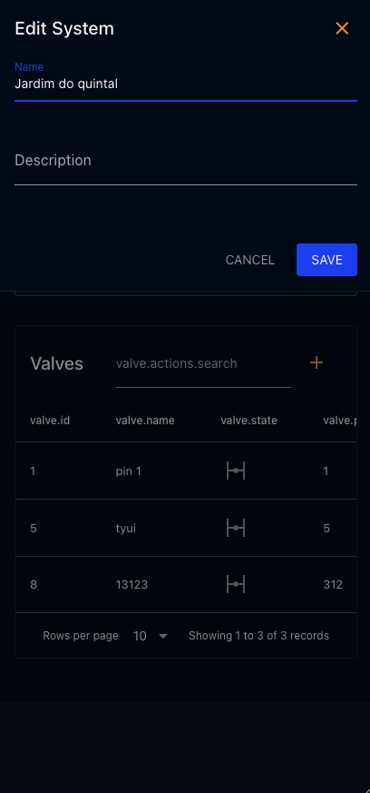

### Single system turned on in dark mode
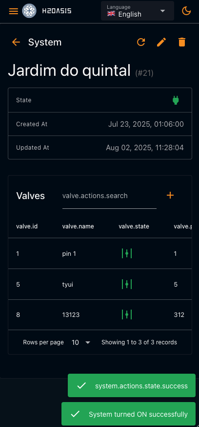
